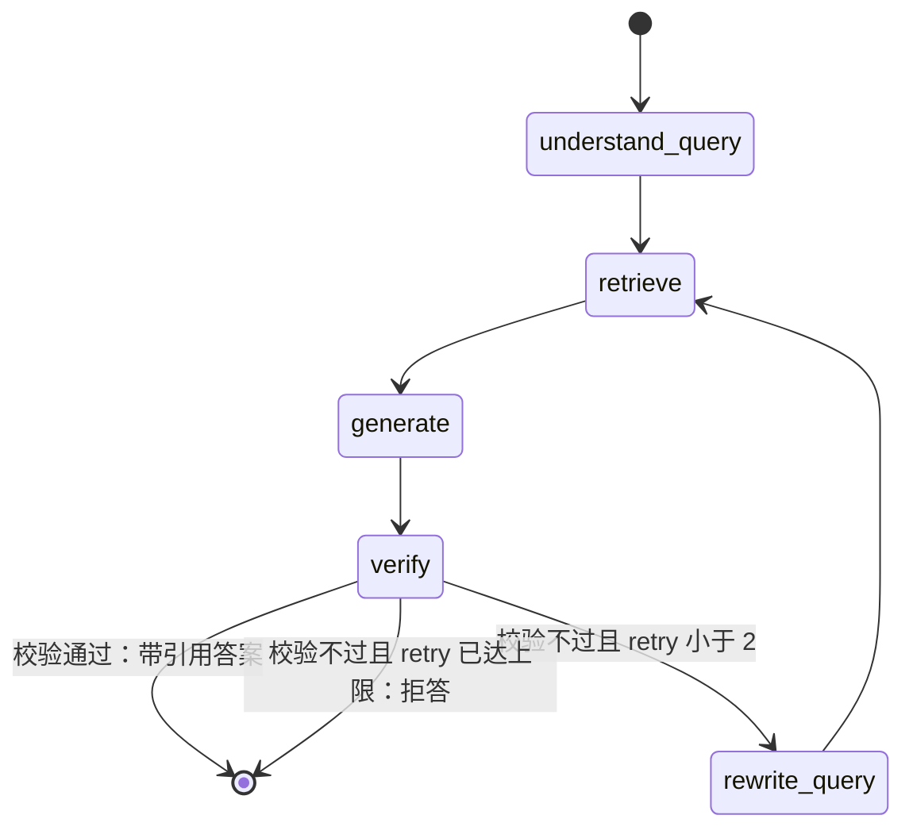

# FinRAG — 金融研报知识库问答系统

> 项目二（与 DataCrew 电商智能问数**零代码共享、强差异化**）：
> DataCrew 答"数据库里有什么"（结构化数据 / text-to-SQL / 安全闸），
> FinRAG 答"研报里怎么说的"（非结构化文档 / 检索增强生成 / 引用校验）。
> 独立仓库、独立数据库（端口 5433 vs DataCrew 的 5432）、独立镜像。

## 1. 系统架构

```
                ┌──────────────────────────────────────────────┐
                │                  FastAPI (D5)                 │
                │   POST /ask  SSE 流式：节点轨迹+引用+结论      │
                └───────────────────┬──────────────────────────┘
                                    │
                ┌───────────────────▼──────────────────────────┐
                │            LangGraph 问答图 (D5)              │
                │  查询理解 → 混合检索 → 重排 → 带引用生成 → 引用校验 │
                │                    │ 证据不足                  │
                │                    ▼ 改写查询重检索（有上限）    │
                └───────────────────┬──────────────────────────┘
                                    │
       ┌────────────────────────────┼────────────────────────────┐
       ▼                            ▼                            ▼
┌─────────────┐            ┌────────────────┐            ┌──────────────┐
│  Embedder   │            │  pgvector 检索库 │            │  LLM (D5)    │
│ bge-small-zh│            │ 向量+关键词并集  │            │ DeepSeek/ Mock│
│ 本地 ONNX   │            │ 元数据过滤(行业) │            │              │
└─────────────┘            └────────────────┘            └──────────────┘
       ▲
       │ 入库流水线（app/rag/ingest.py）
┌──────┴──────────────────────────────────────┐
│ 合成研报语料（app/rag/corpus.py）            │
│ Markdown → 结构感知分块 → 向量化 → upsert    │
│ 每条事实登记进 FactRegistry（评测 ground truth）│
└─────────────────────────────────────────────┘
```

**数据流**：语料生成器产研报 + 事实登记表 → 分块器切块（带章节路径元数据）
→ embedder 向量化 → pgvector 入库。问答时查询向量与关键词双路召回、
并集重排，生成阶段强制引用 chunk，引用校验不过则拒答。

问答状态机图（节点名与 app/rag/graph.py 一致）：



重试环的设计：改写查询时只把 verdict 里的真实缺失证据词（数字/中文实词）
拼回问题——状态词（如无对应引用）拼进去会污染下一轮检索。
拒答是正常终态：宁可说没有依据，也不放行无引用或引用对不上的数字论断。

## 2. 目录结构

```
app/
  core/config.py      配置（env 驱动，dim 启动自检）
  core/logging.py     结构化 JSON 日志
  core/winloop.py     Windows Selector 循环（asyncpg 兼容）
  rag/chunker.py      结构感知分块器（章节路径/表格保全/滑动窗口）
  rag/embeddings.py   Embedder 协议：本地 ONNX + 确定性 mock
  rag/store.py        pgvector：schema/写入/向量召回/关键词召回
  rag/corpus.py       合成研报语料 + FactRegistry（ground truth 同源）
  rag/ingest.py       入库流水线编排（CLI: python -m app.rag）
  api/main.py         FastAPI 骨架（D4：健康检查；D5：问答图接入）
deploy/postgres/init/ 实例级扩展（vector + pg_trgm）
tests/                19 个测试：分块不变量/向量契约/语料合法性/检索集成/SSE 单跑回归
```

## 3. 设计决策日志（ADR）

- **ADR-01 向量库用 pgvector 而不是 Chroma/Milvus**：FinRAG 已经有
  postgres（文档元数据、评测结果都存它），向量放同实例不同 schema，
  运维面不扩大；元数据过滤和混合检索（向量+关键词并集）用 SQL 表达最
  直接，不用在应用层缝两个系统。万级-十万级文档 HNSW 完全够，真到千万级
  再迁 Milvus——检索接口是协议，换实现不动上层。
- **ADR-02 embedding 用本地 ONNX 模型（bge-small-zh-v1.5）不用 API**：
  金融语料不出内网；评测要可复现（模型固定→向量固定→检索结果固定）；
  无 key 也能跑全流程。fastembed 比 torch 轻（ONNX Runtime）。保留
  mock 模式（确定性哈希向量）让 CI 不依赖模型下载——mock 测管道通不通，
  不测检索准不准，两者不混用。
- **ADR-03 分块必须结构感知而不是固定长度**：研报是强结构文档，
  "风险提示"标题下第一段永远是风险；固定长度切会把标题和正文切断、
  把两条不同风险并进一块，检索到"半句话"时模型只能编下半句。按标题
  层级切段并携带章节路径元数据，表格整块保留，超长段落才按句子滑动
  窗口切（块间重叠缓解边界丢失）。
- **ADR-04 检索用混合（向量+关键词）而不是纯向量**：金融问答有大量
  精确实体（股票代码、指标名、具体数字），纯向量对精确匹配弱。关键词
  路用 pg_trgm 做子串匹配（内置中文分词对中文按整句切、recall 差），
  两路召回取并集后重排。BM25 留到评测数据说话后再决定是否引入。
- **ADR-05 语料是合成的，且 ground truth 与语料同源**：真实研报有
  版权风险；合成语料的每个数字都由生成器产出并登记进 FactRegistry，
  评测时逐条可回溯——"答案对不对"有确定来源，不依赖人工标注。固定
  随机种子，语料逐字节可复现。
- **ADR-06 端口 5433、独立数据卷**：与 DataCrew 物理隔离，任何一侧
  重建/挂掉不影响另一侧。两个项目的代码也零共享——差异化是刻意的，
  不是懒。

## 4. 当前进度（路线图）

| 天 | 内容 | 状态 |
|---|---|---|
| D4 | 仓库骨架 + 分块/向量/检索/入库 + 合成语料 + 18 测试 | ✅ |
| D5 | LangGraph 问答图：查询理解/混合检索/重排/带引用生成 + SSE API + 33 测试 | ✅ |
| D6 | 评测闭环（36 测试）+ 压测 | ✅ |
| D7 | 与 DataCrew 一起收尾（CI/架构图/简历数字核验） | 待办 |

## 4.5 评测结果（D6，可复现）

跑法：EMBEDDING_MODE=mock python -m app.eval.runner（30 篇 / 90 事实 / seed=42）。
每次 run 落库 eval.runs（metrics + per_fact JSONB），数字可下钻复盘。

| 指标 | 数值 | 说明 |
|---|---|---|
| retrieval_hit@5（vector_only） | 15.6% | 随机基线——mock 向量无语义，这不是模型能力 |
| retrieval_hit@5（keyword_only） | 100% | trigram 子串匹配 + 词长/IDF/指标加权 |
| retrieval_hit@5（hybrid） | 100% | 系统当前策略 |
| answer_accuracy | 100% | 标准答案数字出现在生成答案中（90/90） |
| citation_faithfulness | 100% | 数字论断被引用证据支持的比例 |
| refusal_accuracy | 100% | 幻觉型问题（预测类）被拒答的比例 |
| 延迟 P50 / P95 | 13ms / 14.5ms | mock 模式，无 LLM 网络往返 |
| 压测 QPS（并发 1 到 20） | 55 到 244 | 100 请求每档，0 失败 |

answer_accuracy 63.3% 到 100% 的修复过程（评测驱动，每个数字可复现）：

1. MockLLM 自己重新编号引用（prompt 里 [c2] 的证据标成 [c1]）-> 保留原始编号
2. [cN] 里的数字被当成数据论断 -> 摘引用标记必须排在查数字之前
3. 引用放句尾被断句拆散 -> 先把句末 [cN] 挪到句首
4. 列表序号 1. 被当数字 + 风险提示块被当证据 -> 序号剥离 + 优先选带金额小数的块
5. 指标块排序错误（问归母净利润捞回只写营业收入的概况块）：公司名在每块都
   出现、TF 高，稀释了指标词 -> IDF 加权 + 金融指标词典加权 + 元数据匹配
   （公司名在 source 字段，不匹配则各公司的财务块同分相持）
6. 语料数据合法性：同一公司出多篇不同数字的报告 -> 事实问题有多个答案
   （ground truth 歧义）-> 一篇一公司 + 唯一性不变量测试

诚实边界：以上数字全部是 mock 模式（哈希向量 + 规则假模型）。
vector_only 的 15.6% 是随机基线，不代表真实 embedding 的能力；真实
embedding / 真实 LLM 接入后必须重新标定——评测脚本、语料种子、
落库结构都是为这个重新标定准备的。

## 5. 本地运行

```bash
# 1. 起数据库（独立 postgres，端口 5433）
docker compose up -d

# 2. 装依赖（venv 已建则跳过）
python -m venv .venv && .venv/Scripts/pip install -e ".[dev]"   # Windows
# source .venv/bin/activate && pip install -e ".[dev]"           # Linux

# 3. 入库（mock 向量，不下载模型）
EMBEDDING_MODE=mock python -m app.rag --reports 30

# 4. 测试
EMBEDDING_MODE=mock python -m pytest tests/ -q
```

首次用真实模型（local 模式）会自动下载 bge-small-zh-v1.5（约 100MB），
之后离线可用。换模型必须同步改配置里的 `embedding_dim`——启动时
LocalEmbedder 会自检维度，不匹配直接报错，不会静默建错列。

## 6. 与 DataCrew 的差异化对照

| 维度 | DataCrew | FinRAG |
|---|---|---|
| 数据形态 | 结构化（500k 订单表） | 非结构化（研报文档） |
| 核心链路 | text-to-SQL + 七道安全闸 | 混合检索 + 引用校验 |
| 主要风险 | SQL 注入/越权/删库 | 幻觉/引用不实/答非所问 |
| 人机交互 | 澄清口径 + 大表审批 | 证据不足拒答 + 引用溯源 |
| 评测重点 | 执行类结果哈希 + 行为类拦截 | 检索命中率 + 引用忠实度 + 答案正确性 |
| 数据库 | postgres 5432（含 pgvector 备用） | postgres 5433（pgvector 主力） |
- **ADR-07 SSE 用 stream_mode=["updates","values"] 一次跑完，绝不 astream 后重跑**：初版 /ask 先 astream("updates") 推节点事件，终态再 await ask() 把完整图**重跑一遍**——一次 SSE 请求两轮 LLM 调用（成本/延迟双倍），且 /ask 与 /ask/sync 并发时 checkpointer 两路写可能把"未初始化"的旧状态读回来。修复后一次 astream 同时拿节点增量（推事件）和全量快照（最后一个即终态）。回归测试 tests/test_sse_single_run.py 把旧入口 ask 换成"一调用就炸"的探针，双跑复发立刻红。
- **ADR-08 HNSW 索引算子类必须与查询运算符一一对应**：查询用 `<=>`（余弦距离），索引就必须是 vector_cosine_ops。曾经索引建成 vector_ip_ops——向量已 L2 归一化时两者数值等价，但 pgvector 的算子类与运算符是绑定关系，计划器直接用不上该索引，万行 chunks 全表扫描。D7 实测（150 行演示库，SET enable_seqscan=off 强制索引）：cosine 索引 → Index Scan，ip 索引 → Seq Scan。小表时规划器自己也会选 Seq Scan，这个 fix 的价值在数据量上来之后。
